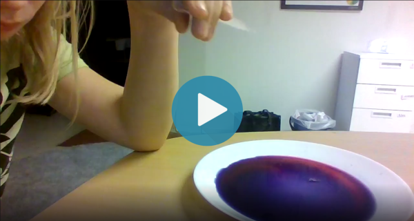
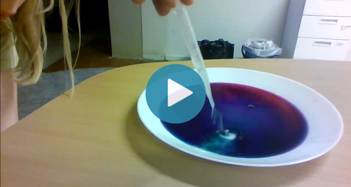

# Surt eller Basiskt
### Simon Svensson Thunman 04/02-2022
## Innehåll
[Syfte](#syfte)

[Hypotes](#hypotes)

[Matrial](#matrial)

[Resultat](#resultat)

[Slutsats](#slutsats)
## Syfte
Syftet är att undersöka om den lila vätskan ändrar färg.
## Hypotes
Jag tror mest att den kommer byta färg.
## Matrial
### Bägare 1
Citronsaft
### Bägare 2
Vatten + Bakpulver
### Bägare 3
Vatten + Maskindiskmedel
## Resultat
### Bägare 1
[Bägare 1](#bägare-1) bytte färgen till rosa.

Innan:

Efter:

### Bägare 2
[Bägare 2](#bägare-2) gjorde inte så mycket.

### Bägare 3
[Bägare 3](#bägare-3) gjorde vattnet grönt.

## Slutsats
Färgen ändades för att [Bägare 1](#bägare-1) var surt och bägare [2](#bägare-2) och [3](#bägare-3) var basiskt. Den lila vätskan var neutral.
