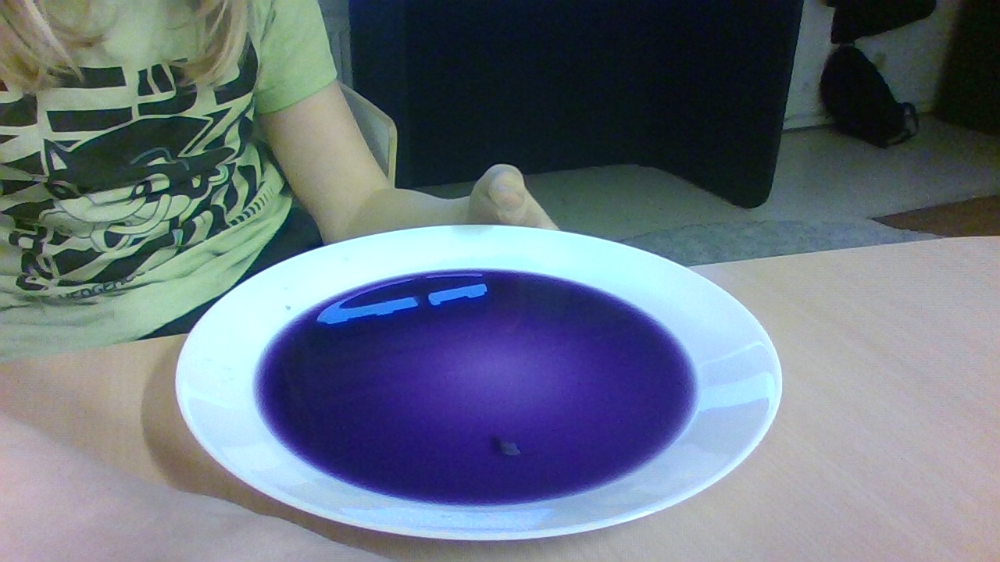

# Surt eller Basiskt
### Simon Svensson Thunman 04/02-2022
## Innehåll
[Syfte](#syfte)

[Hypotes](#hypotes)

[Matrial](#matrial)
## Syfte
Syftet är att undersöka om den lila vätskan ändrar färg.
## Hypotes
Jag tror mest att den kommer byta färg.
## Matrial
### Bägare 1
Citronsaft
### Bägare 2
Vatten + Bakpulver
### Bägare 3
Vatten + Maskindiskmedel
## Utförande
### Bägare 1
[Bägare 1](#bägare-1) bytte färgen till rosa.

Innan:

Efter:

### Bägare 2
[Bägare 2](#bägare-2) gjorde inte så mycket.

<iframe width="560" height="315" src="https://www.youtube.com/embed/E8OwNqJeqII" title="YouTube video player" frameborder="0" allow="accelerometer; autoplay; clipboard-write; encrypted-media; gyroscope; picture-in-picture" allowfullscreen></iframe>
